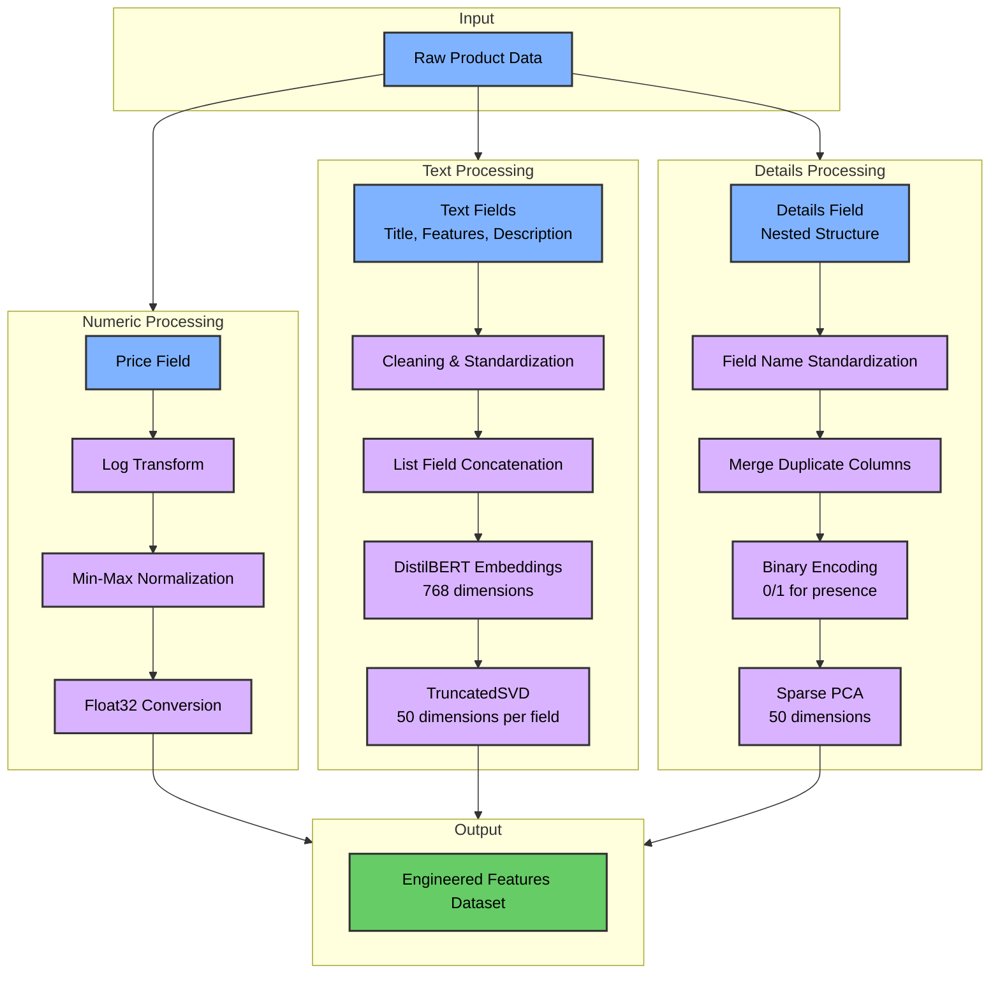

# Amazon Product Classification System Design Specification

## 1. Problem

This project addresses the challenge of automatically classifying product listings into appropriate categories based on their attributes. The system uses semi-structured data containing product details to perform multi-class classification across 28 predefined categories.

### Key Challenges:

An initial glance at the training data will easily tell you that the biggest problem here is going to be feature engineering. The model selection and hyperparameter tuning, and evaluation will be straightforward, but many iterations will need to be done in order to process different versions of engineered features in order to determine which will yield the best results.

- Highly heterogeneous data structures
  - see the data-discovery notebook or docs for details
- Low number of numeric fields, high number of string fields
  - sematic value will have to be extracted from string fields for processing
- Natively high dimensional feature space
  - across the data set the Details element contains ~200 unique fields
  - Features and Description element contain list contains many sub-elements
- Time and compute constraints
  - high dimensional feature space will increase training time
  - extracting semantic value from text can be compute intensive
  - 28 unique classes within the target label
  - ~43k data elements to train on

## 2. Assumptions

- The unlabaled data is simliar to the labled data
  - all analysis was done on the labeled dataset
  - we are assuming the unlabled data is fundamentally simliar 
  - no systematic testing is done in this project to verify this
  - we will assume that future batches of unlabled data will be fundamentally simliar
  - the only check we have against data drift, is some model monitoring, covered below
- Text fields (Title, Features, Description) contain some valuable semantic information
- Details field contains useful classification signals despite variability across products
- Tree-based models will handle heterogeneous data effectively
- Processing requires balancing model complexity with performance

## 3. Solution Design

### 3.1 Data Preprocessing

#### Numeric Fields (Price)
- Log transformation normalizes the skewed distribution
- Min-max normalization preserves null values as distinct signals
- Float32 type conversion for memory efficiency

#### Text Fields (Title, Features, Description)
- Text preprocessing removes special characters
- List field concatenation into single strings
- DistilBERT embeddings capture semantic meaning
- TruncatedSVD reduces dimensionality from 768 to 50 components per field

#### Details Field (Nested Structure)
- Field name standardization (lowercase, special character replacement)
- Duplicate column merging for consistency
- Binary encoding (0/1) indicating presence/absence of each attribute
- Sparse PCA reduces dimensionality from 42,429 columns to 50 components

#### Features to Excluded

- SKU: Removed due to extremely high uniqueness (97.77%), which would lead to overfitting
- Manufacturer: Excluded as a standalone feature since the semantic information is captured in the text embeddings
- Raw Text Fields: Removed original text fields after embedding generation to reduce dimensionality

### 3.2 ML Model Selection

XGBoost was selected as the classification algorithm for these reasons:
- Effective handling of heterogeneous data types
- Native support for missing values without imputation
- Computational efficiency compared to deep learning approaches
- Strong performance on tabular data
- Regularization parameters to prevent overfitting

### 3.3 Training

1. **Data Splitting**
   - Stratified train/validation/test split (60%/20%/20%)
   - Subsample of data used for efficient hyperparameter tuning

2. **Hyperparameter Optimization**
   - RandomizedSearchCV explores parameter space efficiently
   - Parameters tuned: learning rate, tree depth, estimator count, regularization
   - 5-fold cross-validation for robust parameter selection

3. **Final Model Training**
   - Training on full dataset with optimized hyperparameters
   - Early stopping to prevent overfitting
   - ~90-91% accuracy achieved on hold-out test set

### 3.4 Hyperparameter Tuning

### 3.5 Testing

### 3.6 Metrics

- Overall: accuracy, precision, recall, F1 (macro and weighted)
- Per-class metrics to identify category-specific performance
- Top-k accuracy (k=3, k=5)
- Confusion matrix visualization
- SHAP values for feature importance analysis

### 3.7 Deployment

- Trained model saved with parameters and metadata
- Command-line interface for batch processing of unlabeled data
- Prediction outputs saved in both Parquet and CSV formats
- System designed for reproducibility and easy re-execution

### 3.8 Monitoring

### Model Monitoring
- Track prediction distribution shifts over time
- Monitor class-specific performance metrics
- Implement alerting for significant accuracy drops

### Retraining Strategy
- Periodic retraining with fresh data (monthly/quarterly)
- Compare new model performance against baseline
- Version control for models and training datasets

### Error Analysis
- Automated logging of misclassified products
- Regular review of high-confidence incorrect predictions
- Identification of problematic categories or feature patterns

### 3.9 Maintenance

## 4. Alternative Solutions

1. **Deep Learning Approaches**
   - Multi-modal neural networks could potentially achieve higher accuracy
   - Would require significantly more training time and resources
   - Advantage: Could better model complex relationships in textual data

2. **Ensemble Methods**
   - Combining multiple models (XGBoost, Random Forest, Neural Networks)
   - Advantage: Diversity of learning approaches could improve accuracy
   - Disadvantage: More complex to maintain and deploy

3. **Advanced Text Processing**
   - Entity recognition or topic modeling for text fields
   - Advantage: More nuanced feature extraction
   - Disadvantage: Additional complexity without guaranteed performance gains

4. **Feature Selection Techniques**
   - More rigorous feature selection or feature importance filtering
   - Advantage: Simpler model with faster inference time
   - Disadvantage: Potential loss of predictive power

## 5. Open Questions

1. How would the model perform on new products from categories not represented in training?
2. Could a more sophisticated approach to the Details field further improve performance?
3. Would incorporating image data (if available) significantly improve classification accuracy?
4. How stable is model performance over time as product descriptions and attributes evolve?
5. What is the minimum set of features needed to maintain current accuracy?
6. Could the system be extended to recommend new categories when products don't fit existing ones?
