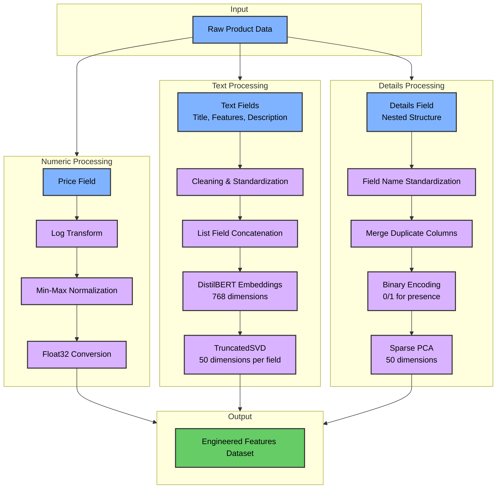

# Amazon Product Classification System Design Specification

## TOC

```
├── 1. Problem
│   └── Key Challenges
├── 2. Assumptions
├── 3. Solution Design
│   ├── 3.1 Data Preprocessing
│   ├── 3.2 ML Model Selection
│   ├── 3.3 Training
│   ├── 3.4 Hyperparameter Tuning
│   ├── 3.5 Testing
│   ├── 3.6 Metrics
│   ├── 3.7 Deployment
│   ├── 3.8 Monitoring
│   └── 3.9 Maintenance
├── 4. Alternative Solutions
└── 5. Open Questions
```

## 1. Problem

This project addresses the challenge of automatically classifying product listings into appropriate categories based on their attributes. The system uses semi-structured data containing product details to perform multi-class classification across 28 predefined categories.

### Key Challenges:

An initial glance at the training data will easily tell you that the biggest problem here is going to be feature engineering. The model selection and hyperparameter tuning, and evaluation will be straightforward, but many iterations will need to be done in order to process different versions of engineered features in order to determine which will yield the best results.

- Highly heterogeneous data structures
  - See the data-discovery notebook or docs for details
- Low number of numeric fields, high number of string fields
  - Sematic value will have to be extracted from string fields for processing
- Natively high dimensional feature space
  - Across the data set the Details element contains ~200 unique fields
  - Features and Description element contain list contains many sub-elements
- Time and compute constraints
  - High dimensional feature space will increase training time
  - Extracting semantic value from text can compute intensive
  - 28 unique classes within the target label
  - ~43k data elements to train on

## 2. Assumptions

- The unlabeled data is similar to the labeled data
  - All analysis was done on the labeled dataset
  - We are assuming the unlabeled data is fundamentally similar 
  - No systematic testing is done in this project to verify this
  - We will assume that future batches of unlabeled data will be fundamentally similar
  - The only check we have against data drift, is some model monitoring, covered below
- Text fields (Title, Features, Description) contain some valuable semantic information
- Details field contains useful classification signals despite variability across products
- Tree-based models will handle heterogeneous data effectively
- Processing requires balancing model complexity with performance

## 3. Solution Design

### 3.1 Data Preprocessing



#### Numeric Fields (Price)
- Log transformation normalizes the skewed distribution
- Min-max normalization preserves null values as distinct signals
- Float32 type conversion for memory efficiency

#### Text Fields (Title, Features, Description)
- Text preprocessing removes special characters
- List field concatenation into single strings
- DistilBERT embeddings capture semantic meaning
- TruncatedSVD reduces dimensionality from 768 to 50 components per field

#### Details Field (Nested Structure)
- Field name standardization (lowercase, special character replacement)
- Duplicate column merging for consistency
- Binary encoding (0/1) indicating presence/absence of each attribute
- Sparse PCA reduces dimensionality from 42,429 columns to 50 components

#### Features to Excluded

- SKU: Removed due to extremely high uniqueness (97.77%), which would lead to overfitting
- Manufacturer: Excluded as a standalone feature since the semantic information is captured in the text embeddings
- Raw Text Fields: Removed original text fields after embedding generation to reduce dimensionality

### 3.2 ML Model Selection

XGBoost was selected as the classification algorithm for these reasons:
- Effective handling of heterogeneous data types
- Native support for missing values without imputation
- Computational efficiency compared to deep learning approaches
- Strong performance on tabular data
- Regularization parameters to prevent overfitting

### 3.3 Training

- **Data Splitting**
  - Implemented a stratified train/validation/test split (60%/20%/20%) to maintain representation across all 28 categories despite significant class imbalance
  - Created a stratified subsample for hyperparameter tuning to balance computational constraints with the need for robust parameter selection
  - Stratification was critical due to the long-tail distribution of product categories, with some categories having 10x the instances of others

- **Hyperparameter Optimization**
  - Selected RandomizedSearchCV over GridSearchCV due to computational constraints with the high-dimensional dataset (150+ features after engineering)
  - Used a stratified 10,000-sample subset to ensure representation across all categories while reducing the expected search time from 4-5 days to approximately 16 hours
  - Executed in parallel across 8 threads (half of available capacity) to balance between search speed and preventing system resource exhaustion
  - Selected parameter ranges based on preliminary experiments that indicated the model needed substantial complexity to distinguish between similar product categories

- **Final Model Training**
  - Applied optimal parameters from RandomizedSearchCV to the full dataset with early stopping (50 rounds) to address overfitting risk from high-dimensional input
  - The model achieved ~90-91% accuracy on the hold-out test set with acceptable macro-F1 scores despite class imbalance
  - Early stopping rounds were increased from 15 (used during tuning) to 50 for the final model to better accommodate the larger dataset and ensure convergence
  - For detailed training implementation, see `scripts/_02_model_training_and_tuning.py`

### 3.4 Hyperparameter Tuning

- **Search Strategy Rationale**
  - The 25-iteration randomized approach provided an efficient balance between exploration and exploitation within computational constraints
  - Despite limiting thread allocation, internal parallelization of XGBoost pushed CPU utilization above 95%, with processor temperatures exceeding 95°C
  - Initial experiments with GridSearchCV indicated a full grid search would require approximately 4-5 days, making it impractical for iterative development

- **Parameter Selection Considerations**

| Parameter | Range | Rationale |
|-----------|-------|-----------|
| n_estimators | 100-300 | Complexity required for 28-class problem with high-dimensional feature space |
| max_depth | 4-8 | Balance between capturing complex interactions and preventing overfitting |
| learning_rate | 0.01-0.05-0.1 | Balance convergence speed with stability for heterogeneous features |
| min_child_weight | 1, 3, 5 | Control model complexity and handle noisy data |
| gamma | 0, 0.1, 0.2 | Fine-tune node splitting thresholds |
| subsample, colsample_bytree | 0.8-0.9 | Provide regularization without harming minority class performance |


- **Final Hyperparameter Profile**
  - The optimized hyperparameters collectively reflect a model tuned for this specific product classification challenge
  - With n_estimators=300 and max_depth=8, the model favors the complexity necessary for distinguishing between 28 product categories using heterogeneous inputs
  - The moderate learning_rate=0.05 combined with min_child_weight=1 and gamma=0 suggests the feature engineering effectively reduced noise, allowing the model to utilize subtle patterns
  - subsample=0.8 and colsample_bytree=0.9 provide just enough regularization to prevent overfitting on high-dimensional text embeddings while preserving signal
  - Detailed analysis of hyperparameter selection rationale is available in `notebooks/performance-and-explainability.ipynb`


### 3.5 Testing

- **Holdout Evaluation Approach**
  - Reserved 20% of data for final testing, stratified to maintain class distribution across all 28 categories
  - Evaluated model on previously unseen data to simulate real-world performance
  - Implemented testing workflow in `scripts/_03_performance_and_explainability.py` with automated metric calculation
  - Created reproducible testing pipeline to support future model iterations and comparison

- **Validation Strategy**
  - Used separate validation set (20% of training data) during model development to monitor overfitting
  - Employed early stopping with validation error monitoring to determine optimal training duration
  - Maintained consistent data splitting methodology between hyperparameter tuning and final evaluation

- **Error Analysis Procedure**
  - Focused investigation on categories with poor performance metrics
  - Examined misclassification patterns between semantically related categories
  - Analyzed impact of support size (number of examples) on category performance
  - Implemented visualizations to identify classification threshold optimization opportunities

### 3.6 Metrics

- **Overall Performance Metrics**
  - Calculated comprehensive metrics suite including overall accuracy, precision, recall, and F1 scores (both macro and weighted)
  - Implemented top-k accuracy metrics (k=3, k=5) to measure model's ability to include correct category in top predictions
  - Strong overall accuracy (~90%) with excellent top-k metrics (top-3 >97%, top-5 >98%)
  - Notable gap between macro and weighted metrics indicates class imbalance impact
  - Macro recall (~80%) emerged as the lowest metric, suggesting challenges with minority categories

| Metric Type | Value | Description |
|-------------|-------|-------------|
| Overall Accuracy | ~90% | Percentage of correctly classified products |
| Top-3 Accuracy | >97% | Percentage where correct category appears in top 3 predictions |
| Top-5 Accuracy | >98% | Percentage where correct category appears in top 5 predictions |
| Macro F1 | ~85% | Average F1 score across all categories |
| Macro Recall | ~80% | Average recall across all categories (lowest metric) |
| Weighted F1 | ~90% | F1 score weighted by class frequency |

- **Per-Class Performance Analysis**
  - Generated confusion matrix to identify cross-category confusion patterns, particularly between related product groups
  - Calculated per-class metrics to pinpoint category-specific performance variations
  - Discovered significant performance variation across categories (>95% for some, <70% for others)
  - Found categories with larger support generally performed better (Fashion, Automotive, Tools & Home Improvement)
  - Identified problematic electronics subcategories showing cross-confusion (All Electronics, Home Audio & Theater, Car Electronics)

- **Feature Importance Analysis**
  - Utilized SHAP (SHapley Additive exPlanations) values to interpret model predictions and feature contributions
  - Derived global feature importance metrics to identify the highest-impact features across categories
  - Found structured data fields (details) and title embeddings provided the strongest classification signals
  - Determined that product details_3 field had by far the highest importance (0.46)
  - Concluded that detailed performance visualizations and analysis are available in `notebooks/performance-and-explainability.ipynb`

### 3.7 Deployment

This section outlines both the current implementation approach and a potential production deployment strategy. The command-line execution framework described first represents what was practical for this academic research project given time and resource constraints. The production implementation proposal presents a more robust architecture that would be appropriate for deploying this classification system in a real-world enterprise environment.

- **Current Implementation**
  - Project provides a central entry point through `main.py` that orchestrates the execution of individual scripts
  - The pipeline can be run with default settings using a simple command: `python main.py`
  - Execution can be customized with command-line arguments for input location, subsample size, and processing steps
  - For running only specific steps: `python main.py --run unzip engineer` or `python main.py --run apply`
  - For detailed execution instructions and available parameters, refer to the README.md

- **Production Deployment Proposal**
  - **Containerization**: Package the model training pipeline in Docker containers to ensure consistency across environments
    - Separate containers for data processing, model training, and inference to enable independent scaling
    - Use base images with pre-installed dependencies (Python, PyTorch, etc.) to reduce build time
    - Include GPU support for feature engineering and model training acceleration

  - **Orchestration**:
    - Implement Airflow DAGs to manage the model lifecycle
    - Configure triggers for retraining based on schedule, data volume, or drift detection
    - Design modular workflow with clear separation between data preparation, feature engineering, training, and evaluation

  - **API Layer**:
    - Deploy trained models as microservices behind API endpoints using FastAPI
    - Implement batched prediction endpoints for bulk classification
    - Develop lightweight synchronous prediction for real-time classification needs
    - Create standardized API documentation using OpenAPI/Swagger

### 3.8 Monitoring

The current implementation exports model metrics and artifacts for each training run locally, providing a foundation for evaluation and comparison. A production-grade monitoring system would extend this to ensure model health and performance over time.

- **Current Monitoring Approach**
  - Stores model parameters, metrics, and metadata with timestamped filenames
  - Generates comprehensive performance metrics for each model version
  - Saves confusion matrices and feature importance data for offline analysis
  - Exports artifacts to local filesystem for comparison between runs
  - Implementation details available in `scripts/_03_performance_and_explainability.py`

- **Production Monitoring Proposal**
  - **Model Registry and Versioning**:
    - Use MLflow to track experiments, log parameters, metrics, and model artifacts
    - Store model versions with associated performance metrics for comparison
    - Implement A/B testing framework for new model candidates before promotion
    - Configure automatic rollback mechanisms if performance degrades

  - **Data Quality Monitoring**:
    - Implement statistical tests to detect distribution shifts in incoming data
    - Monitor feature value distributions for drift compared to training data
    - Set alerts for changes in class distribution or feature correlations
    - Track null value rates and other data quality metrics

  - **Performance Monitoring**:
    - Deploy Prometheus and Grafana for real-time performance dashboards
    - Track prediction distribution over time to detect concept drift
    - Monitor class-specific metrics to identify degradation in particular categories
    - Set up automated alerting for performance drops below established thresholds
    - Implement logging for inference latency, throughput, and error rates

  - **Storage and Metrics Pipeline**:
    - Store model artifacts and training data in S3 or MinIO object storage
    - Implement data versioning to track dataset evolution over time
    - Create centralized metrics repository for longitudinal analysis
    - Set up automated reporting for stakeholders with key performance indicators

### 3.9 Maintenance

This section covers both code maintenance practices to ensure project longevity and model maintenance strategies to sustain classification performance over time.

- **Code Maintenance**
  - **Version Control**:
    - Maintain clean Git repository with descriptive commit messages
    - Implement branch protection and pull request reviews
    - Use semantic versioning for release management
    - Document breaking changes in release notes

  - **Testing Framework**:
    - Develop unit tests for critical components (data processing, feature engineering)
    - Implement integration tests for the complete pipeline
    - Create regression tests to catch performance degradation
    - Set up continuous integration to run tests automatically

  - **Documentation**:
    - Maintain up-to-date inline code documentation and docstrings
    - Update README and specification documents for major changes
    - Document environment setup and dependencies
    - Create troubleshooting guides for common issues

  - **Dependency Management**:
    - Use requirement files with pinned versions for reproducibility
    - Regularly update dependencies to address security vulnerabilities
    - Test compatibility with new versions of critical libraries
    - Consider containerization to isolate environment dependencies

- **Model Maintenance**
  - **Retraining Strategy**:
    - Implement periodic retraining schedule (monthly/quarterly)
    - Define triggers for ad-hoc retraining (data drift, performance degradation)
    - Establish minimum data thresholds for adding new categories
    - Document model lifecycle management procedures

  - **Error Analysis**:
    - Implement automated logging of misclassified products
    - Schedule regular review of high-confidence incorrect predictions
    - Develop process for investigating problematic categories or feature patterns
    - Create feedback loops from production misclassifications to training data

  - **Feature Evolution**:
    - Monitor feature importance metrics for stability over time
    - Evaluate potential new features based on error analysis findings
    - Develop process for testing and integrating new feature engineering techniques
    - Consider regular review of embedding models for potential upgrades

  - **Category Management**:
    - Define process for adding or merging product categories
    - Establish minimum data requirements for new categories
    - Develop strategies for handling emerging product types
    - Create procedures for mapping between category taxonomies

## 4. Alternative Solutions

### Low-Engineering-Time Improvements

| Approach | Description | Complexity | Expected Benefit |
|----------|-------------|------------|------------------|
| Enhanced Hyperparameter Optimization | Replace RandomizedSearchCV with GridSearchCV for exhaustive evaluation | Low | Marginal accuracy improvement (1-2%) |
| Advanced Text Embedding Models | Replace DistilBERT with full BERT or more advanced transformer models | Medium | Better semantic understanding of product text |
| Better Feature Dimensionality Reduction | Replace TruncatedSVD/SparsePCA with UMAP for nonlinear dimensionality reduction | Medium | Potentially better feature space representation |
| Enhanced Preprocessing | Add more sophisticated text cleaning, improved null handling | Low | Small improvement in edge cases |
| Traditional ML Alternatives | Implement Random Forest, Logistic Regression with L1, Naive Bayes for text, or LightGBM as XGBoost alternative | Low-Medium | Better interpretability or faster training with comparable performance |

**Enhanced Hyperparameter Optimization**
- Replace RandomizedSearchCV with GridSearchCV for exhaustive evaluation of all hyperparameter combinations
- Expand hyperparameter search space with finer granularity (more values per parameter)
- Implement Bayesian optimization approaches (SMAC, Hyperopt) for more efficient parameter searching
- Increase `random_iterations` parameter to explore more combinations in the existing framework

**Advanced Text Embedding Models**
- Replace DistilBERT with full BERT or more advanced transformer models
- Utilize RoBERTa or DeBERTa for stronger contextual understanding
- Explore domain-specific pre-trained models (e.g., models trained on e-commerce data)
- Increase the embedding dimension from 50 to a higher value to preserve more semantic information

**Better Feature Dimensionality Reduction**
- Replace TruncatedSVD/SparsePCA with UMAP for nonlinear dimensionality reduction
- Apply t-SNE for better visualization of feature spaces
- Implement hierarchical dimensionality reduction (reduce each field first, then combine)
- Tune dimensionality reduction parameters like `n_components` to find optimal information preservation

**Enhanced Preprocessing**
- Add more sophisticated text cleaning (lemmatization, stop word removal)
- Implement more advanced null value handling strategies for the price field
- Apply feature scaling to more numeric fields in the dataset
- Increase maximum token length for BERT embeddings to capture longer product descriptions

**Traditional ML Alternatives**
- Implement Random Forest with feature importance analysis to identify the most discriminative product attributes
- Explore linear models like Logistic Regression with L1 regularization for interpretable feature selection
- Apply Naive Bayes classifiers specifically optimized for the text components of product data
- Consider gradient-boosted decision trees like LightGBM as an efficient alternative to XGBoost with different regularization mechanics

### Substantial Re-architecture Solutions

| Approach | Description | Complexity | Expected Benefit |
|----------|-------------|------------|------------------|
| Fine-Grained Feature Engineering | Process individual detail fields with specialized techniques | High | Better use of product-specific attributes |
| Advanced Text Processing | Generate embeddings for manufacturer/SKU, apply topic modeling | High | Extract more semantic information |
| External Data Integration | Utilize third-party datasets matched via SKU | High | Additional context for classification |
| Deep Learning Approaches | Multi-modal neural networks handling text, categorical, and numerical data | Very High | Potential for significant accuracy gains |
| Ensemble Methods | Build diverse model ensemble combining tree-based and neural approaches | High | Improved robustness and accuracy |
| Hierarchical Classification | Implement two-stage classification process (main → subcategory) | Medium | Better handling of similar product types |

**Fine-Grained Feature Engineering**
- Process individual detail fields with specialized techniques instead of binary encoding
- Extract structured data from text fields (dimensions, weights, materials) using regex patterns
- Engineer features based on domain knowledge of product categories
- Create custom feature sets for each product category for specialized classification

**Advanced Text Processing**
- Generate text embeddings for the `manufacturer` and `SKU` fields
- Apply topic modeling to extract themes from description text
- Implement named entity recognition to identify product attributes in unstructured text
- Use multi-lingual models to handle product descriptions in multiple languages

**External Data Integration**
- Utilize third-party datasets matched via SKU for enhanced feature creation
- Incorporate brand reputation data or market position information
- Add price benchmarking data relative to category norms
- Include product popularity or demand metrics from external sources

**Deep Learning Approaches**
- Implement multi-modal neural networks handling text, categorical, and numerical data
- Create a custom architecture combining transformer layers for text with dense layers for other features
- Apply transfer learning from pre-trained e-commerce classification models
- Develop attention mechanisms to focus on the most relevant product attributes

**Ensemble Methods**
- Build diverse model ensemble combining tree-based and neural approaches
- Implement stacking with XGBoost as meta-learner over various base models
- Create specialized models for different product categories and combine predictions
- Use boosting techniques to iteratively improve classification performance

**Hierarchical Classification**
- Implement a two-stage classification process (main category → subcategory)
- Train separate models for products with similar characteristics
- Develop a taxonomy-aware classification system that respects product hierarchies
- Use confidence scores to determine when to apply specialized vs. general classifiers

**Advanced Model Interpretability**
- Implement more sophisticated SHAP analysis for feature importance per category
- Create interaction feature analyses to understand feature relationships
- Develop custom explainability metrics for product classification contexts
- Generate category-specific importance profiles for better understanding of model decisions

## 5. Open Questions

- My first and probably my biggest questions is how well the alternate solutions mentioned in the above section would actually work? ~90% accuracy isn't terrible, but I don't feel really good about a model until I get at least a few 9's.   
- How well would this model work given the actual number of training items an online retailer is likely to have if we were able to grab a sample that went back a few years in time (which I suspect could be in the millions for large online retailers)?
- How would this model do over time, assuming there would be some level of data drift over time?