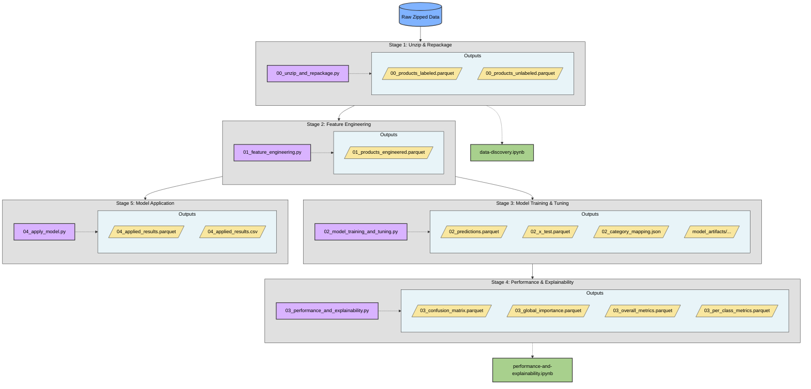
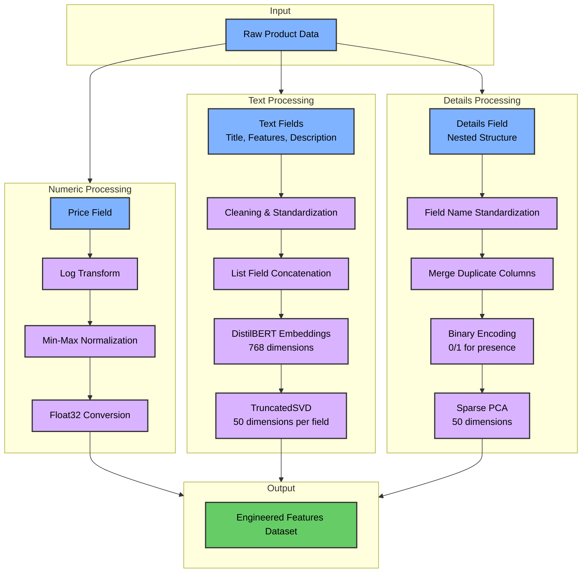

# amazon-product-classification

The purpose of this repo is to take semi-structured data describing products, perform a multi-class classification on that data, and to document the problem, assumptions, solutions, and further questions.   

## Project Structure

```
├── data/                         # data files containing data at various stages of processing
│   ├── model_artifacts/          # saved model files and parameters
│   └──  zipped/                   # raw compressed source data files
├── config/                       # contains a .css file used for docs conversion
├── docs/                         # contains flat file documentation 
├── notebooks/                    # analysis and visualization of the process
│   ├── data-discovery.ipynb
│   └── performance-and-explainability.ipynb
├── results/                      # contained data items used with the apply_model script
├── scripts/                      # python scripts that execute all core tasks
│   ├── _00_unzip_and_repackage.py
│   ├── _01_feature_engineering.py
│   ├── _02_model_training_and_tuning.py
│   ├── _03_performance_and_explainability.py
│   └── _04_apply_model.py
├── venv/                         # python virtual environment
├── .gitignore
├── main.py                       # main entry point for the pipeline
├── readme.md
├── requirements.in               # for uv package install
└── requirements.out              # for uv package install
```

## Setup

1. Clone the repository:
   
```bash
git clone <repository-url>
cd amazon-product-classification
```
 
2. Create a virtual environment:

```bash
python -m venv venv
```

3. Activate the virtual environment:

```bash
# Windows
venv\Scripts\activate

# macOS/Linux
source venv/bin/activate
```

4. Install uv package manager to your virtual environment:

```bash
pip install uv
```

5. Install dependencies using the requirements file:

```bash
uv pip install -r requirements.out
```

6. (Optional) If you need to modify dependencies:
   - Edit the requirements.in file
   - Regenerate requirements.out:
   
```bash
uv pip compile requirements.in -o requirements.out
```

7. (Optional) For GPU support with PyTorch:
   - First uninstall the CPU version of PyTorch that was installed in step 5:
   
```bash
uv pip uninstall torch torchvision torchaudio
```

   - Then install the appropriate CUDA version based on your hardware:
   
```bash
# Example for CUDA 11.8 - adjust based on your system
uv pip install torch torchvision torchaudio --torch-backend=cu118
```

pandoc ./docs/Design-Spec.md -o ./docs/Design-Spec.html -F mermaid-filter.cmd --standalone --css=./docs/custom.css

> Note: The PyTorch GPU package is approximately 3GB in size and may take several minutes to download

## Docs

The docs section contains several documents flat file documents that can be accessed and shared. They include:

> .pdf version of all docs are provided, however not all features were available via pdf format; use of either the .html version of the docs is recommended; all .html docs can be opened via any browser  

> Dependencies are required for the file conversion operations below; full instructions will not be given here 

### Product-Spec.md
- contains the following information:

```
├── 1. Problem
│   └── Key Challenges
├── 2. Assumptions
├── 3. Solution Design
│   ├── 3.1 Data Preprocessing
│   ├── 3.2 ML Model Selection
│   ├── 3.3 Training
│   ├── 3.4 Hyperparameter Tuning
│   ├── 3.5 Testing
│   ├── 3.6 Metrics
│   ├── 3.7 Deployment
│   ├── 3.8 Monitoring
│   └── 3.9 Maintenance
├── 4. Alternative Solutions
└── 5. Open Questions
```

### Product-Spec.html
- contains identical contains to Product-Spec.md
- converted from .md to .html via Pandoc:

```bash
pandoc ./docs/Design-Spec.md -o ./docs/Design-Spec.html -F mermaid-filter.cmd --standalone --css=./config/custom.css
```

### Product-Spec.pdf
- contains identical contains to Product-Spec.md
- manually converted from .html to .pdf 


### Data-Discovery.html
- .html copy of `./notebooks/data-discovery.ipynb`
- converted to .html via nbconvert: 

```bash
jupyter nbconvert --to html "./notebooks/data-discovery.ipynb" --output-dir "./docs/" --output "Data-Discovery"
```

### Data-Discovery.pdf
- .pdf copy of `./notebooks/data-discovery.ipynb`
- manually converted from `.docs/Data-Discovery.html` 

### Performance-and-Explainability.html
- .html copy of `./notebooks/performance-and-explainability.ipynb`
- converted to .html via nbconvert:

```bash
jupyter nbconvert --to html "./notebooks/performance-and-explainability.ipynb" --output-dir "./docs/" --output "Performance-and-Explainability"
````

### Performance-and-Explainability.pdf
- .pdf copy of `./notebooks/performance-and-explainability.ipynb`
- manually converted from `.docs/Data-Discovery.html`


## Script Execution

The project provides a central entry point through `main.py` that orchestrates the execution of individual scripts. You can run the entire pipeline or specific parts based on your needs.

> Note: This project is principally and academic project and not intended for production use. This code should be considered brittle. This code base contains insufficient error handling and unexpected parameters will produce errors. 

### Basic Usage

To run the entire pipeline with default settings:

```bash
python main.py
```

This will execute all steps sequentially:
1. Unzip and repackage raw data
2. Perform feature engineering
3. Train and tune the model
4. Generate performance metrics and explanations

### Command Line Arguments

The following arguments are available to customize execution:

```bash
python main.py [OPTIONS]
```

| Argument | Description | Default |
|----------|-------------|---------|
| `--input-dir` | Directory containing zipped files | `./data/zipped` |
| `--data-dir` | Directory to save data files | `./data` |
| `--subsample-size` | Size of stratified subsample for tuning | `5000` |
| `--random-iterations` | Number of random iterations for RandomizedSearchCV | `5` |
| `--run` | Specify which steps to run | `["unzip", "engineer", "train", "explain"]` |

### Running Specific Steps

You can choose to run only specific steps of the pipeline:

```bash
# Run only the unzip and feature engineering steps
python main.py --run unzip engineer

# Run only the model training step
python main.py --run train

# Run only the model explanation step
python main.py --run explain
```

### Run pipeline on new unlabeled data

```bash
# unzip and place output in results folder
python main.py --run unzip --input-zip "./data/zipped/products_unlabeled.json.gz" --data-dir "./results"

# perform feature engineering
python main.py --run engineer --data-dir "./results"

# run model and store results
python main.py --run apply --data-dir "./results"
```

### Examples

1. Process data and train with a larger subsample:

```bash
python main.py --subsample-size 10000 --random-iterations 10
```

2. Run just the model training with custom data locations:

```bash
python main.py --data-dir ./custom_data --run train
```

3. Run the full pipeline with all data in a different location:

```bash
python main.py --input-dir ./raw_data --data-dir ./processed_data
```

4.  Run full pipeline with set numer of random iterations and custom subsample size

```bash
python main.py --random-iterations 500 ---subsample-size 10000	 
```


### Resource Considerations

- The feature engineering step utilizes BERT embeddings which can be compute-intensive. GPU acceleration is recommended.
- The model training step uses multiprocessing to utilize available CPU cores.
- Hyperparameter tuning can be time-consuming with larger subsample sizes and more random iterations.


## Workflow

The project follows a modular pipeline approach with each step generating outputs for subsequent steps. While you can now use `main.py` to orchestrate the entire workflow, understanding the individual stages is valuable for development and troubleshooting.

### Data Flow

```
Raw Data (.gz) → Unzipped Data (.parquet) → Engineered Features → Model & Predictions → Performance Metrics
```

### Notebooks
The Jupyter notebooks in the `notebooks/` directory provide analysis and visualization:
- `data-discovery.ipynb`: Exploratory data analysis of raw products 
- `performance-and-explainability.ipynb`: Visualization of model performance and feature importance

Notebooks can be opened and run at any time as they depend on the parquet files in the data directory.

### Processing Scripts

The processing scripts in the `scripts/` directory handle the core data pipeline:

#### 1. `_00_unzip_and_repackage.py`
- Extracts raw products from `.gz` files in `./data/zipped/`
- Converts raw JSON data to Polars dataframes
- Outputs:
  - `./data/00_products_labeled.parquet`
  - `./data/00_products_unlabeled.parquet`
- Note: Using parquet format reduces storage by ~75% compared to raw JSON

#### 2. `_01_feature_engineering.py`
- Processes the labeled data with:
  - Numeric field normalization (price)
  - Text field transformations using DistilBERT embeddings
  - Detail field binary encoding and dimensionality reduction
- Outputs: `./data/01_products_engineered.parquet`

#### 3. `_02_model_training_and_tuning.py`
- Creates train/validation/test splits
- Uses RandomizedSearchCV to optimize XGBoost hyperparameters
- Trains the final model on the full dataset
- Outputs:
  - `./data/model_artifacts/xgb_best_model_*.pkl`
  - `./data/model_artifacts/xgb_best_params_*.json`
  - `./data/model_artifacts/xgb_training_metadata_*.json`
  - `./data/02_predictions.parquet`
  - `./data/02_x_test.parquet`
  - `./data/02_category_mapping.json`

#### 4. `_03_performance_and_explainability.py`
- Generates performance metrics and explainability objects
- Outputs:
  - `./data/03_confusion_matrix.parquet`
  - `./data/03_global_importance.parquet`
  - `./data/03_overall_metrics.parquet`
  - `./data/03_per_class_metrics.parquet`

#### 5. `_04_apply_model.py`

- Loads the most recently trained XGBoost model
- Applies the model to unlabeled product data
- Converts numeric predictions to category names using the mapping
- Outputs:
  - `./data/04_applied_results.parquet`
  - `./data/04_applied_results.csv`

### Workflow Tips

- To rerun the entire pipeline with the original dataset, use `main.py` with default parameters
- For incremental development, run individual scripts as needed with appropriate arguments
- If modifying feature engineering, remember that changes will require retraining the model
- GPU acceleration is recommended for the feature engineering step (BERT embeddings)
- Check the notebook outputs to visualize performance metrics after model training
- Use the apply option with main.py to run predictions on new unlabeled data

### Workflow Diagram



## methodology

### Dataset
The dataset consists of 43,000 product records spanning 28 different categories. Each product record contains various fields including:
- **Category** (target variable): The classification label we aim to predict
- **Price** (numerical): Contains 58.58% null values, highly skewed distribution from $0.01 to $18,999
- **Title** (text): 99.84% distinct values, providing unique product identifiers
- **Features** (list of text strings): 83.25% distinct values, describing product characteristics
- **Description** (list of text strings): 68.69% distinct values, containing marketing copy
- **Details** (nested structure): Contains over 100 different product-specific attributes

Key data characteristics:
- The Details field varies significantly by product type with only 20 attributes present in >10% of products
- Common attributes include Item model number (76.03%), Manufacturer (59.31%), and Product Dimensions (46.25%)
- The data is highly heterogeneous, with different products having different available fields

### Problem
The challenge is to develop a multi-class classifier that can accurately categorize products into one of 28 predefined categories based on their attributes. This supervised learning task requires robust handling of:
- Missing data (notably in price fields)
- Heterogeneous data structures
- Text data requiring semantic understanding
- Sparse feature matrices with high dimensionality

### Assumptions
1. **Text field significance**: Title, Features, and Description contain valuable semantic information that can help identify product categories
2. **Missing value interpretation**: Missing values, particularly in the Price field, reflect the reality of the dataset rather than data quality issues
3. **Detail field utility**: Despite variability across products, the Details field contains useful signals when properly encoded
4. **Dataset representativeness**: The dataset reflects the distribution of products expected in production
5. **Model selection**: Tree-based models will handle the heterogeneous data effectively with both numerical and categorical features
6. **Computational constraints**: Training requires balancing model complexity with performance

### Solution

#### Data Preprocessing and Feature Engineering
The preprocessing pipeline addresses the heterogeneous nature of the data through these specialized approaches:

1. **Numeric fields (Price)**:
   - Log transformation normalizes the highly skewed distribution
   - Min-max normalization preserves null values as distinct signals
   - Float32 type conversion reduces memory usage

2. **Structured fields (Details)**:
   - Field name standardization (lowercase, special character replacement)
   - Duplicate column merging for consistency
   - Binary encoding (0/1) indicating presence/absence of each attribute
   - Sparse PCA reduces dimensionality from 42,429 columns to 50 components while preserving important signals

3. **Text fields (Title, Features, Description)**:
   - Text preprocessing removes special characters and standardizes formatting
   - List field concatenation into single strings
   - DistilBERT embeddings capture semantic meaning efficiently
   - TruncatedSVD reduces embedding dimensionality from 768 to 50 components per text field

This approach balances information preservation with computational efficiency.



#### Model Selection
XGBoost was selected as the classification algorithm for these key reasons:

1. **Heterogeneous data handling**: Effectively processes mixed data types and features of different scales
2. **Missing value support**: Native handling of missing values without requiring imputation
3. **Performance efficiency**: Faster training compared to deep learning approaches
4. **Strong tabular data performance**: Consistent performance on structured data problems
5. **Overfitting resistance**: Regularization parameters help prevent overfitting on high-dimensional data

#### Model Training & Hyperparameter Tuning
The training process followed this systematic approach:

1. **Data splitting**:
   - Stratified train/validation/test splits (60%/20%/20%) ensure representation of all 28 categories
   - 10,000-sample stratified subset enables efficient hyperparameter tuning

2. **Initial model baseline**:
   - XGBoost model with default hyperparameters establishes performance baseline
   - Multi:softmax objective function for multi-class classification

3. **Hyperparameter optimization**:
   - RandomizedSearchCV on the stratified subset efficiently explores parameter space
   - Key parameters tuned: learning rate, tree depth, estimator count, regularization
   - 5-fold cross-validation ensures robust parameter selection
   - 25 iterations balance exploration with computational constraints

4. **Final model training**:
   - Full dataset training with optimized hyperparameters
   - Early stopping (50 rounds) prevents overfitting
   - ~90-91% accuracy achieved on hold-out test set

5. **Model preservation**:
   - Trained model, parameters, and metadata saved for reproducibility and deployment

#### Performance Evaluation
Model performance is evaluated through:
- Overall accuracy, precision, recall, and F1 scores
- Per-class metrics to identify category-specific performance
- Confusion matrix visualization in the performance notebook
- Feature importance analysis using SHAP values

### Potential Alternate Solutions
Alternative approaches considered include:

1. **Deep Learning**: A multi-modal neural network architecture could potentially achieve higher accuracy but would require significantly more training time and resources

2. **Ensemble methods**: Combining multiple models (XGBoost, Random Forest, Neural Networks) might improve accuracy through diverse learning approaches

3. **Advanced text processing**: Entity recognition or topic modeling might extract more nuanced features from text fields

4. **Feature selection**: More rigorous feature selection could identify the most predictive features and simplify the model

### Open Questions
1. How would the model perform on new products from categories not represented in the training data?

2. Could a more sophisticated approach to handling the Details field further improve performance?

3. Would incorporating image data (if available) significantly improve classification accuracy?

4. How stable is the model performance over time as product descriptions and attributes evolve?

5. Could a simpler model achieve comparable performance with faster inference time?

6. What is the minimum set of features needed to maintain the current level of accuracy?

## license

MIT License
